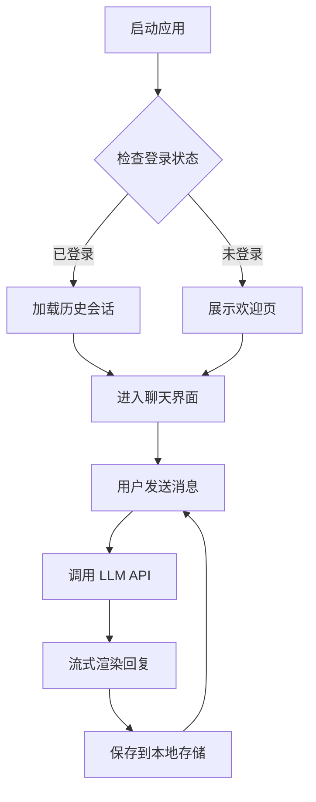

# Mock 流式响应内容

本文件用于本地 Mock 模式下的流式响应模拟，模拟 DeepSeek Chat API 的 SSE 流式输出。

---

## Mock 1：代码展示

以下是一个简单的快速排序实现：

```typescript
function quickSort(arr: number[]): number[] {
  if (arr.length <= 1) return arr;

  const pivot = arr[Math.floor(arr.length / 2)];
  const left = arr.filter(x => x < pivot);
  const mid = arr.filter(x => x === pivot);
  const right = arr.filter(x => x > pivot);

  return [...quickSort(left), ...mid, ...quickSort(right)];
}

console.log(quickSort([3, 6, 8, 10, 1, 2, 1]));
// 输出: [1, 1, 2, 3, 6, 8, 10]
```

这段代码的核心思想是：
- **选取基准值**（pivot）
- **分区**：小于 pivot 的放左边，大于的放右边
- **递归**对左右两部分继续排序

---

## Mock 2：数学公式

一元二次方程 \(ax^2 + bx + c = 0\) 的求根公式为：

$$
x = \frac{-b \pm \sqrt{b^2 - 4ac}}{2a}
$$

其中判别式 \(\Delta = b^2 - 4ac\) 决定方程根的性质：

| 判别式 | 方程根情况 |
|--------|-----------|
| \(\Delta > 0\) | 两个不相等的实根 |
| \(\Delta = 0\) | 两个相等的实根（重根） |
| \(\Delta < 0\) | 两个共轭复根 |

---

## Mock 3：Mermaid 图表

生命周期的简单流程：



---

## Mock 4：一般对话

你好！我是 chatAI，一个基于 Vue 3 的 AI 对话助手。

我可以帮你：

- **解答问题** — 从编程到日常生活的各类疑问
- **代码编写** — 支持多种语言的代码生成与解释
- **文档撰写** — 帮你起草文章、邮件、报告等
- **数据分析** — 解释数据模式，提供洞见

你可以点击下方的快捷问题快速开始，也可以直接输入任何问题。试试看吧！
